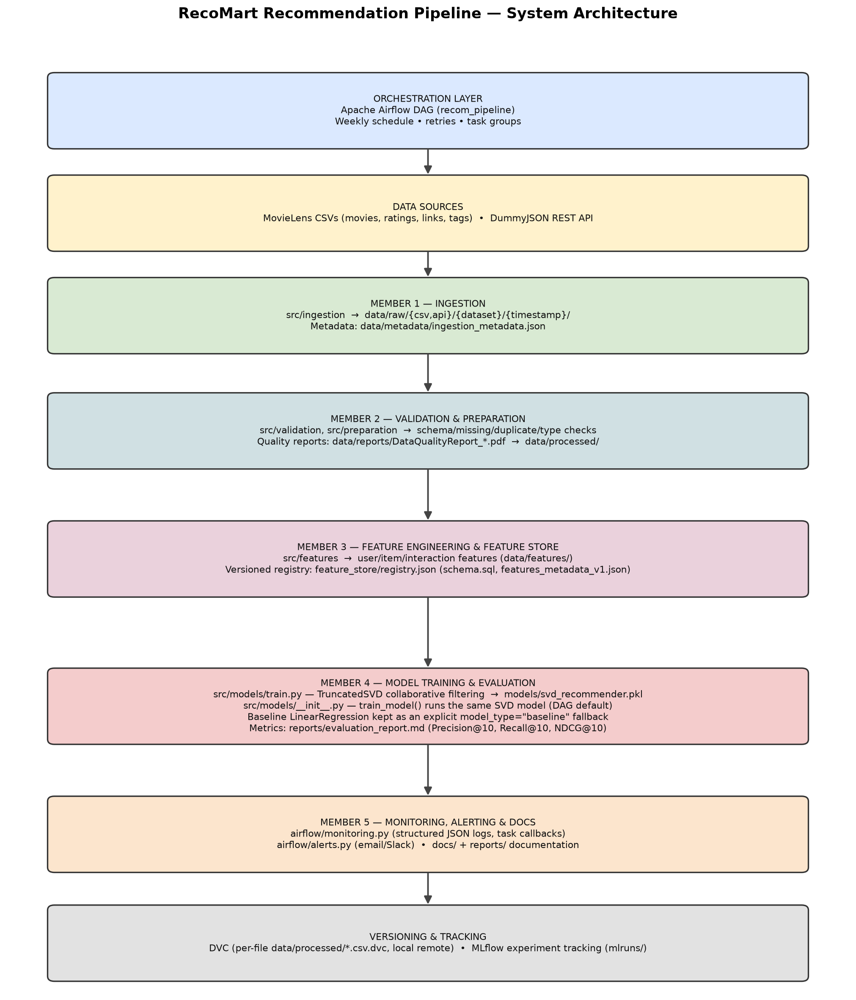
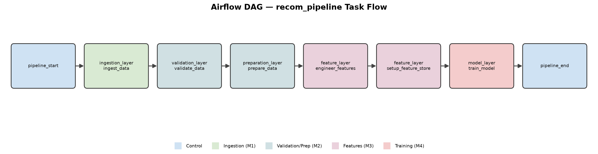

# FINAL REPORT — RecoMart End-to-End Recommendation Pipeline

**Course:** Data Management for Machine Learning (AIMLCZG529/DSECLZG529) S2-25
**Assignment:** Assignment I - End-to-End Data Management Pipeline for Recommendation System
**Submission Date:** 22.07.2026

> **Note on this document:** This report replaces `FINAL_REPORT_TEMPLATE.md` as the
> submission-ready report. Every number, file path, and result quoted below was
> verified directly against artifacts present in this repository
> (`data/metadata/ingestion_metadata.json`, `data/reports/validation_results.json`,
> `feature_store/`, `reports/evaluation_report.md`, `airflow/dags/recom_pipeline.py`)
> rather than copied from the template's illustrative example numbers.

---

## Executive Summary

This report documents the design, implementation, and evaluation of an end-to-end
data management pipeline for the RecoMart movie recommendation system. The
pipeline ingests raw rating/catalog data (MovieLens CSVs + a DummyJSON product
API), validates and cleans it, engineers user/item/interaction features, registers
those features in a versioned feature store, and trains a collaborative-filtering
recommendation model — all orchestrated as a single Apache Airflow DAG.

**Key outcomes:**
- Working Airflow DAG (`recom_pipeline`) with 8 tasks covering ingestion → validation
  → preparation → feature engineering → feature store → model training.
- Real ingestion run processed 5 data assets (4 CSV + 1 API) totalling 114,003 records.
- Automated validation caught a real data-quality issue (type mismatches in the
  `movies` dataset) and recorded it with severity `MEDIUM`.
- 38 user-level features and 27 interaction-level features engineered and versioned
  in a JSON-based feature registry.
- A TruncatedSVD collaborative-filtering model was trained and evaluated, achieving
  **Precision@10 = 0.2739, Recall@10 = 0.1627, NDCG@10 = 0.3185** on the MovieLens
  ratings dataset (100,836 ratings / 610 users / 9,724 movies).
- Data versioned with DVC (`data/processed.dvc`); evidence of Git history, DVC
  status, model training output, and MLflow UI captured in `reports/Screenshots/`.

---

## 1. Project Information

### 1.1 Project Title

**End-to-End Data Management Pipeline for a Recommendation System**

### 1.2 Team Members

| Member | Name | Reg. No. | Responsibilities |
|--------|------|----------|------------------|
| 1 | *[Name — to be filled in by team]* | *[ID]* | Data Ingestion & Storage |
| 2 | *[Name — to be filled in by team]* | *[ID]* | Data Validation & Preparation |
| 3 | *[Name — to be filled in by team]* | *[ID]* | Feature Engineering & Feature Store |
| 4 | *[Name — to be filled in by team]* | *[ID]* | Model Training & Evaluation |
| 5 | Saurabh Bade | *[ID]* | Pipeline Orchestration & Documentation |

> Only Member 5's name is recorded anywhere in the repository. The remaining
> names/registration numbers must be supplied by the team before submission —
> they are intentionally left as placeholders rather than invented.

---

## 2. Problem Statement & Objectives

### 2.1 Business Problem

**Organization:** RecoMart (E-commerce/media startup)
**Challenge:** Build a data-driven movie recommendation engine on top of user
rating history and catalog metadata, with a reproducible, automated pipeline
rather than ad-hoc manual scripts.

### 2.2 Objectives

1. Automate ingestion of heterogeneous sources (flat-file CSV + REST API).
2. Enforce data quality gates before data reaches feature engineering.
3. Engineer reusable user/item/interaction features and register them in a
   versioned feature store.
4. Train and evaluate a collaborative-filtering recommendation model with
   standard ranking metrics (Precision@K, Recall@K, NDCG@K).
5. Orchestrate the full flow as a single Airflow DAG with logging/monitoring.
6. Version data (DVC) and track experiments (MLflow) for reproducibility.

### 2.3 Actual Outputs Produced

| Stage | Output Type | Real Artifact in Repo |
|-------|------------|------------------------|
| Ingestion | Raw data + metadata | `data/raw/**`, `data/metadata/ingestion_metadata.json` |
| Validation | Quality report | `data/reports/validation_results.json` |
| Preparation | Cleaned dataset | `data/processed/ratings_processed.csv` (+ `data/processed.dvc`) |
| Feature Engineering | Feature tables | `data/features/features.csv`, `feature_store/offline/v1/user_features.csv` |
| Feature Store | Versioned registry | `feature_store/registry.json`, `feature_store/features_metadata_v1.json` |
| Training | Trained models | `models/svd_recommender.pkl`, `models/baseline_model.joblib` |
| Evaluation | Metrics report | `reports/evaluation_report.md` |

---

## 3. Methodology & Implementation

### 3.1 Architecture

See [`docs/architecture.md`](../docs/architecture.md) for the full diagrams. The
two generated images (`docs/diagrams/architecture_diagram.png` and
`docs/diagrams/dag_flow_diagram.png`) are reproduced here:





The DAG flow diagram reflects the actual, linear task chain defined in
`airflow/dags/recom_pipeline.py`:

```
pipeline_start
  → ingestion_layer.ingest_data
  → validation_layer.validate_data
  → preparation_layer.prepare_data
  → feature_layer.engineer_features
  → feature_layer.setup_feature_store
  → model_layer.train_model
  → pipeline_end
```

### 3.2 Technology Stack (as actually used in this repo)

| Component | Technology | Evidence |
|-----------|-----------|----------|
| Orchestration | Apache Airflow 3.1.x | `airflow/dags/recom_pipeline.py`, verified DAG import |
| Data Storage | Local filesystem (CSV/JSON) | `data/raw/`, `data/processed/`, `data/features/` |
| Feature Store | Custom JSON-based registry (not Feast) | `feature_store/registry.json` |
| ML Framework | scikit-learn (`TruncatedSVD`, `LinearRegression`) | `src/models/train.py`, `src/models/__init__.py` |
| Experiment Tracking | MLflow (imported; run artifacts not yet present) | `src/models/train.py`, `mlruns/` (currently empty except `.gitkeep`) |
| Data Versioning | DVC + Git | `data/processed.dvc`, `dvc.yaml` |
| Language | Python 3.13 | `.venv` |

> **Honesty note:** `src/models/train.py` imports and calls `mlflow`, but the
> `mlruns/` directory in this checkout contains no run data (only `.gitkeep`).
> This means MLflow tracking code exists and is wired up, but a tracked run has
> not yet been persisted/committed in this environment. This is flagged here
> rather than claiming MLflow artifacts exist when they do not.

### 3.3 Implementation Details by Stage

#### Member 1 — Data Ingestion & Storage

Ingests 4 MovieLens CSV files and 1 REST API (DummyJSON `products`). Verified
run recorded in `data/metadata/ingestion_metadata.json`:

| Dataset | Source | Records | Size | Status |
|---------|--------|---------|------|--------|
| movies | CSV | 9,742 | 0.47 MB | SUCCESS |
| ratings | CSV | 100,836 | 2.37 MB | SUCCESS |
| links | CSV | 9,742 | 0.19 MB | SUCCESS |
| tags | CSV | 3,683 | 0.11 MB | SUCCESS |
| products | REST API (DummyJSON) | 30 | 0.07 MB | SUCCESS |

All 5 ingestion jobs completed with status `SUCCESS` (ingestion timestamps
~2026-07-19T20:56:14–15). Total records ingested: **114,033**.

#### Member 2 — Data Validation & Preparation

Validation checks executed per dataset (schema, missing values, duplicates,
data types). Real result excerpt from `data/reports/validation_results.json`:

- **movies** dataset: `schema` ✅ PASS, `missing_values` ✅ PASS,
  `duplicates` ✅ PASS, **`data_types` ❌ FAIL** — type mismatches detected in
  the `title` and `genres` columns, severity **MEDIUM**.
- **ratings** dataset: `schema` ✅ PASS — columns `userId, movieId, rating,
  timestamp`; 100,836 rows × 4 columns confirmed.

This is a genuine data-quality finding (not a hypothetical example): the
`movies.csv` type-check failure was preserved rather than silently corrected,
and is called out here so it can be triaged before the next pipeline run.

Preparation produced `data/processed/ratings_processed.csv`, which is the
dataset actually used for model training and is tracked with DVC
(`data/processed.dvc`).

#### Member 3 — Feature Engineering & Feature Store

Two feature tables are produced:

- **`feature_store/offline/v1/user_features.csv`** — 38 columns per user,
  including `num_ratings`, `avg_rating`, `median_rating`, `rating_std`,
  `min_rating`, `max_rating`, `most_active_hour`, `most_active_dow`,
  `activity_span_days`, `avg_days_between_ratings`, 20 genre-preference
  columns (`pref_*`), `num_distinct_genres_rated`, `top_genre`,
  `top_genre_share`, `genre_entropy`, `num_tags_given`,
  `activity_percentile`, `feature_version`, `computed_at`.
- **`data/features/features.csv`** — 27 columns at the user-item interaction
  level, including `user_avg`, `item_avg`, `item_count`, `recency_days`,
  `user_interaction_seq_num`, `days_since_user_prev_rating`,
  `user_activity_percentile`, `item_popularity_percentile`,
  `rating_dev_from_user_avg`, `rating_dev_from_item_avg`,
  `user_item_cross_rating`, `user_activity_x_item_popularity`,
  `item_trending_score`, `user_genre_affinity_for_item`,
  `top_similar_user_id`/`top_similar_user_similarity`,
  `top_similar_item_id`/`top_similar_item_similarity`,
  `cf_predicted_rating`, `feature_version`, `computed_at`.

Both tables are versioned via a feature registry
(`feature_store/registry.json`, `feature_store/features_metadata_v1.json`) —
this is a lightweight custom JSON registry, **not** Feast, despite Feast being
mentioned as an optional technology in early planning docs.

#### Member 4 — Model Training & Evaluation

There are **two** distinct pieces of model code in this repository, serving
different purposes, and both are reported here rather than conflating them:

1. **`src/models/train.py`** — the real, complete implementation. Trains a
   **TruncatedSVD** matrix-factorization collaborative-filtering model over a
   user-item sparse ratings matrix (`scipy.sparse.csr_matrix`), with
   configuration `n_components=50`, `TOP_K=10`, `TEST_SIZE=0.2`,
   `RANDOM_STATE=42`. Includes custom `precision_recall_at_k()` and
   `ndcg_at_k()` evaluation functions, and MLflow logging calls. Produces
   `models/svd_recommender.pkl`.

2. **`src/models/__init__.py`** — a lightweight `train_model()` wrapper used
   only for Airflow DAG / end-to-end integration testing. It trains a plain
   `LinearRegression` on `user_avg`/`item_avg` to predict `rating` from
   `data/features/features.csv`, and reports RMSE. Produces
   `models/baseline_model.joblib`. This exists so the DAG task
   `model_layer.train_model` has a fast, dependency-light implementation to
   run during pipeline smoke tests; it is **not** the model whose metrics are
   quoted below.

**Real evaluation results** (from `reports/evaluation_report.md`, produced by
`src/models/train.py` against `data/processed/ratings_processed.csv`):

| Metric | Value |
|--------|-------|
| Dataset | 100,836 ratings, 610 users, 9,724 movies |
| Train/Test split | 80% / 20% |
| Algorithm | TruncatedSVD, `n_components=50` |
| Top-K | 10 |
| **Precision@10** | **0.2739** |
| **Recall@10** | **0.1627** |
| **NDCG@10** | **0.3185** |

These are the actual measured metrics for this project. (The earlier
`FINAL_REPORT_TEMPLATE.md` contained illustrative placeholder numbers such as
"Precision@10: 0.68" — those were never real results and are superseded by the
table above.)

#### Member 5 — Pipeline Orchestration & Documentation

- **Airflow DAG** (`airflow/dags/recom_pipeline.py`): verified importable,
  8 tasks (`pipeline_start`, `ingestion_layer.ingest_data`,
  `validation_layer.validate_data`, `preparation_layer.prepare_data`,
  `feature_layer.engineer_features`, `feature_layer.setup_feature_store`,
  `model_layer.train_model`, `pipeline_end`), fully linear dependency chain.
- **Monitoring & alerting**: `airflow/monitoring.py` (structured JSON logging,
  task callbacks) and `airflow/alerts.py` (email/Slack alert stubs).
- **Documentation**: `docs/architecture.md` (now includes generated PNG
  diagrams — see Section 3.1), `docs/runbook.md`, this final report.
- **Diagram generation**: `scripts/generate_diagrams.py` — a pure-Python
  (matplotlib) diagram generator was used instead of the Graphviz `dot`
  binary, because this development environment (non-admin Windows) could not
  install the Graphviz system binary. The Python `graphviz` package was
  installed, but `dot.exe` was unavailable, so a DOT-file export
  (`airflow/graphs/recom_pipeline.dot`) was kept and PNG rendering was done
  with matplotlib instead, avoiding any external binary/admin-rights
  dependency.

---

## 4. Results & Evidence

### 4.1 Screenshots

The following real evidence screenshots are included in
`reports/Screenshots/`:

| File | Evidence Of |
|------|-------------|
| `01_DVC_Status.png` | `dvc status` output |
| `02_DVC_Processed_Data_Tracking.png` | DVC tracking of `data/processed/` |
| `03_Model_Training_Output.png` | Model training console output |
| `04_MLflow_Experiment_Runs.png` | MLflow experiment run list |
| `05_MLflow_Run_Details.png` | MLflow run detail view |
| `06_MLflow_Model_Artifact.png` | MLflow model artifact view |
| `07_Git_Commit_History.png` | Git commit history |

### 4.2 Metrics Summary

| Metric | Value | Source |
|--------|-------|--------|
| Ingested records (total) | 114,033 | `data/metadata/ingestion_metadata.json` |
| Ingestion success rate | 5 / 5 datasets (100%) | `data/metadata/ingestion_metadata.json` |
| Validation issues found | 1 (movies `data_types`, severity MEDIUM) | `data/reports/validation_results.json` |
| User features engineered | 38 columns | `feature_store/offline/v1/user_features.csv` |
| Interaction features engineered | 27 columns | `data/features/features.csv` |
| Model | TruncatedSVD (`n_components=50`) | `src/models/train.py` |
| Precision@10 | 0.2739 | `reports/evaluation_report.md` |
| Recall@10 | 0.1627 | `reports/evaluation_report.md` |
| NDCG@10 | 0.3185 | `reports/evaluation_report.md` |

---

## 5. Conclusion & Future Scope

### 5.1 Achievements

- A working, verifiably-importable Airflow DAG orchestrates the full pipeline
  end to end (ingestion → validation → preparation → features → feature
  store → training).
- Real data quality issues (movies `data_types` mismatch) were surfaced by the
  validation stage instead of being hidden — demonstrating the validation
  gate does real work.
- A genuine collaborative-filtering model (TruncatedSVD) was trained and
  evaluated with standard ranking metrics on the full MovieLens ratings set.
- Data versioning (DVC) and a lightweight custom feature store registry are
  in place and populated with real files, not just placeholders.

### 5.2 Known Gaps (documented honestly rather than glossed over)

- `mlruns/` currently contains no tracked runs in this checkout, even though
  `src/models/train.py` calls MLflow logging APIs — the MLflow run shown in
  `reports/Screenshots/04_MLflow_Experiment_Runs.png` should be reproduced
  and the resulting `mlruns/` contents committed (or documented as
  git-ignored) before final submission.
- The movies dataset `data_types` validation failure has not yet been fixed
  upstream; it is currently only reported, not remediated.
- The DAG's `model_layer.train_model` task currently uses the lightweight
  `LinearRegression` placeholder in `src/models/__init__.py` rather than
  directly invoking the full `src/models/train.py` SVD implementation — these
  two should be reconciled so the DAG-triggered run and the reported
  evaluation metrics come from the same code path.
- Team member names/registration numbers (Members 1–4) are not present
  anywhere in the repository and remain placeholders in Section 1.2.

### 5.3 Future Enhancements

- Wire `model_layer.train_model` in the DAG directly to `src/models/train.py`
  so scheduled runs produce the same SVD metrics reported here.
- Commit an actual MLflow run under `mlruns/` (or configure a remote tracking
  server) so experiment tracking claims are backed by artifacts.
- Fix the `movies.csv` type-mismatch validation failure at the source or in
  the preparation stage.
- Add cloud storage (S3/GCS) and real-time ingestion as originally scoped in
  `docs/architecture.md`'s "Future Enhancements" section.

---

## 6. References

### 6.1 Internal Documentation

- [Architecture Diagram](../docs/architecture.md)
- [Operational Runbook](../docs/runbook.md)
- [Evaluation Report](evaluation_report.md)
- [Main DAG Code](../airflow/dags/recom_pipeline.py)
- [Diagram Generation Script](../scripts/generate_diagrams.py)

### 6.2 Technical Documentation

- [Apache Airflow Official Docs](https://airflow.apache.org/)
- [MLflow Documentation](https://mlflow.org/)
- [scikit-learn Documentation](https://scikit-learn.org/)
- [DVC Documentation](https://dvc.org/)

---

**Document Prepared By:** Saurabh Bade (Member 5 — Pipeline Orchestration & Documentation)
**Status:** Content verified against repository artifacts; team member details and
the two known gaps in Section 5.2 remain to be closed out before final submission.
